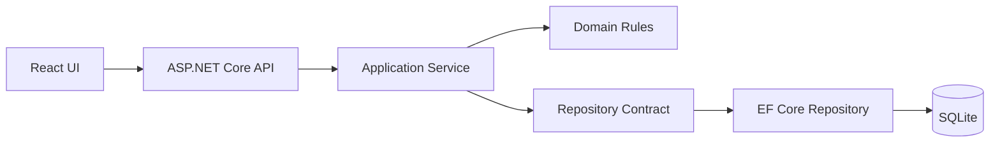
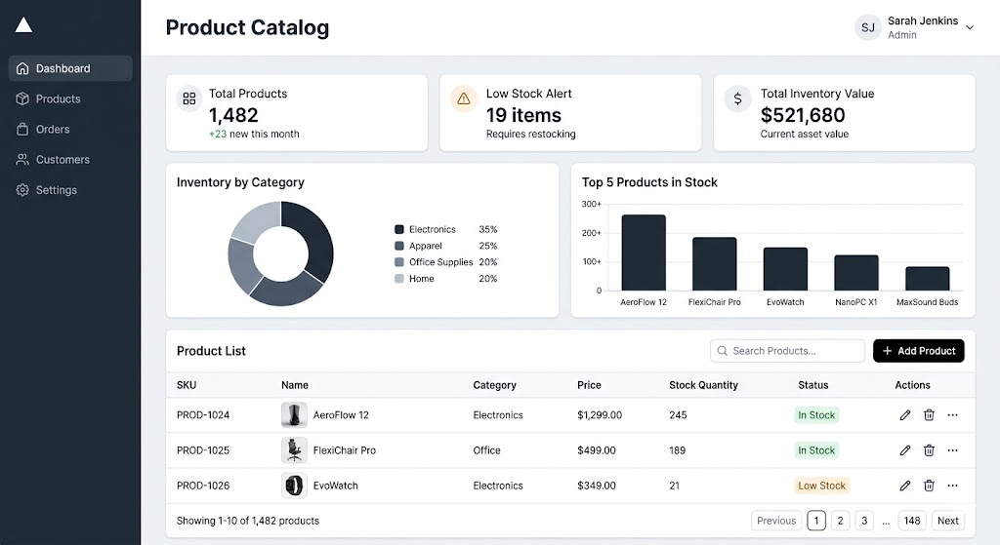

# Projeto Areco - Sistema de Gestao de Produtos

Este repositorio contem uma aplicacao full stack para gestao de produtos, desenvolvida como teste tecnico. O projeto foi construído com foco em arquitetura limpa, regras de negocio explicitas, experiencia do avaliador e facilidade de manutencao.

---

## 1. Visao Geral

### O que este projeto entrega

- Backend em ASP.NET Core .NET 8 com arquitetura em camadas:
	- Domain
	- Application
	- Infrastructure
	- Api
- Frontend em React + TypeScript + Vite para operacoes de catalogo.
- Persistencia com SQLite via EF Core.
- Migrations aplicadas automaticamente no startup.
- Logs estruturados com Serilog.
- Testes automatizados de regras criticas com xUnit, Moq e FluentAssertions.

### Objetivo tecnico avaliado
       
Mais do que "fazer CRUD", este projeto demonstra:

- capacidade de separar responsabilidades por camada;
- implementacao de regras de negocio de forma consistente;
- tratamento padronizado de erros;
- observabilidade e rastreabilidade;
- preocupacao com DX (Developer Experience) para avaliacao rapida.

---

## 2. Como Rodar (Guia para Leigos)

Este passo a passo foi escrito para quem nunca rodou um projeto full stack.

### 2.1. Pre-requisitos

Instale estes itens:

1. .NET SDK 8
2. Node.js 20+
3. Git

### 2.2. Verifique instalacoes

Abra um terminal e rode:

```powershell
dotnet --version
node --version
npm --version
git --version
```

### 2.3. Clone o repositorio

```powershell
git clone <URL_DO_REPOSITORIO>
cd projetoAreco
```

### 2.4. Rode o Backend

Em um terminal:

```powershell
cd Loja.Api
dotnet restore
dotnet run --launch-profile http
```

Backend esperado:

- API: http://localhost:5200
- Swagger: http://localhost:5200/swagger

### 2.5. Rode o Frontend

Em outro terminal:

```powershell
cd loja-ui
npm install
npm run dev
```

Frontend esperado:

- UI: http://localhost:5173

### 2.6. Primeiro uso

1. Abra http://localhost:5173
2. Entre na pagina de produtos
3. Clique em Add 232 Demo para popular o banco rapidamente
4. Teste busca, filtros, ordenacao, criacao, edicao e exclusao

Observacao importante:

- A carga "Add 232 Demo" so pode ser executada uma vez por banco.

---

## 3. Como o Avaliador Pode Validar Rapido

### Roteiro de 5 minutos

1. Abrir Swagger e validar endpoints de produtos.
2. Subir frontend e verificar listagem paginada.
3. Clicar Add 232 Demo e confirmar populacao.
4. Validar:
	 - filtro por categoria e status;
	 - ordenacao por id, preco e estoque;
	 - low stock alert com valor global correto;
	 - formulario com mascara de preco/quantidade.
5. Rodar testes automatizados.

---

## 4. Features Entregues

### 4.1. Produtos (core)

- CRUD real via API
- Paginação server-side
- Busca server-side com debounce no frontend
- Filtros server-side:
	- categoria (multipla selecao)
	- status (In Stock / Low Stock, multipla selecao)
- Ordenacao:
	- ID: alterna asc/desc
	- Preco: asc -> desc -> volta para ID asc
	- Stock Quantity: asc -> desc -> volta para ID asc
- Menu de acoes por linha com ajuste dinamico de direcao (abre para cima se faltou espaco abaixo)
- Acao de duplicar produto
- Seed de 232 produtos demo (one-shot)

### 4.2. Dashboard

- Cards com metricas de inventario
- Low Stock Alert global (nao limitado a pagina atual)
- Graficos de distribuicao por categoria
- Top 5 produtos por estoque

### 4.3. Outras paginas

- Orders
- Customers
- Settings

Estas paginas estao separadas no shell para demonstrar composicao e escalabilidade da UI.

---

## 5. Arquitetura

### 5.1. Estrutura de camadas

- Loja.Domain
	- Entidades, Value Objects, constantes e contratos de repositorio
	- Nao depende de infraestrutura
- Loja.Application
	- Casos de uso, DTOs e validadores
	- Orquestra regras de negocio com repositorios
- Loja.Infrastructure
	- EF Core, DbContext, migrations e repositorios concretos
- Loja.Api
	- Controllers, pipeline HTTP, middlewares e DI
- Loja.Tests
	- Testes unitarios focados em regras criticas

### 5.2. Fluxo de requisicao



### 5.3. Separacao de responsabilidades

- Controller nao contem regra de negocio.
- Service nao conhece detalhes de HTTP.
- Domain nao conhece EF, API ou UI.
- Infrastructure nao decide regra de negocio, apenas persiste.

Esse desenho reduz acoplamento e facilita evolucao/testes.

---

## 6. Decisoes de Banco de Dados (SQLite + EF Core)

### 6.1. Por que SQLite neste teste tecnico

Foco na Arquitetura:

- Como a avaliacao prioriza organizacao de codigo e separacao de responsabilidades, o banco e um detalhe de implementacao.
- SQLite melhora a experiencia do avaliador: nao exige servidor externo, sobe rapido e funciona localmente sem setup pesado.

### 6.2. EF Core e migrabilidade

- O projeto usa Entity Framework Core com provider SQLite.
- Isso permite migrar para SQL Server no futuro trocando o provider e a connection string, com mudanca minima no codigo da aplicacao.

### 6.3. Migrations automaticas no startup

- A API aplica migrations automaticamente ao iniciar.
- Resultado: o banco/tabelas sao criados sem intervencao manual no primeiro uso.

### 6.4. Baseline para banco legado

- Existe logica para reconhecer banco SQLite legado sem historico de migration e registrar baseline de forma segura.
- Isso evita quebra de startup quando o banco ja existe mas foi criado sem EF migration history.

### 6.5. appsettings com caminho relativo

- Connection string principal:

```json
"ConnectionStrings": {
	"DefaultConnection": "Data Source=loja.db"
}
```

- Em Development, o projeto usa "Data Source=loja.dev.db".

---

## 7. Regras de Negocio Criticas

As regras abaixo sao obrigatorias e cobertas no codigo e nos testes:

1. Estoque nao pode ser negativo.
2. Categoria Electronics exige preco minimo 50.00.
3. SKU deve ser unico.

Defesa em profundidade para SKU unico:

- Validacao na Application antes de persistir.
- Indice unico no banco via EF Core.

---

## 8. Seguranca, Confiabilidade e Limpeza

No escopo do desafio, o backend adota praticas solidas:

- FluentValidation para validar payloads de entrada.
- Validacao de invariantes no Domain.
- GlobalExceptionMiddleware para padrao uniforme de erro.
- DTOs para nao expor entidades de dominio diretamente na API.
- Logs estruturados de eventos e erros.
- CORS configurado para origem explicita do frontend local.

Padronizacao de erro:

- Erros de validacao: resposta com errors por campo.
- Violacao de regra de negocio: ProblemDetails 400.
- Erro inesperado: ProblemDetails 500 com traceId.

---

## 9. Performance e Escalabilidade

### Escolhas aplicadas

- Paginacao no backend (evita trafego e render desnecessarios).
- Busca, filtros e ordenacao no backend (reduz custo no browser).
- AsNoTracking nas consultas de leitura.
- Index unico para SKU.
- Debounce na busca no frontend (300ms).

### Observacao tecnica sobre ordenacao de preco

- No schema atual SQLite, o campo de preco e armazenado como TEXT.
- Para garantir ordenacao numerica correta por preco, foi aplicado fallback controlado em memoria para o subconjunto filtrado antes da paginacao.
- Para volumes muito altos, a evolucao recomendada e migrar o campo para tipo numerico nativo no SQLite e remover esse fallback.

---

## 10. API de Produtos

Base URL: http://localhost:5200

### Endpoints

- GET /api/products
	- query params:
		- pageNumber
		- pageSize
		- searchTerm
		- categories (multiplo)
		- statuses (inStock, lowStock)
		- sortBy (id, price, stockQuantity)
		- sortDirection (asc, desc)
- GET /api/products/dashboard-stats
- GET /api/products/{id}
- POST /api/products
- PUT /api/products/{id}
- DELETE /api/products/{id}
- POST /api/products/seed-demo?count=232

### Exemplo de listagem com filtros e ordenacao

```http
GET /api/products?pageNumber=1&pageSize=10&searchTerm=demo&categories=Electronics&statuses=lowStock&sortBy=price&sortDirection=desc
```

---

## 11. Frontend - Experiencia de Uso

### Design inicial (referencia)

A imagem abaixo representa o design inicial que foi usado como referencia para a construcao desta aplicacao.
Esse design-base foi desenvolvido com apoio de inteligencia artificial e serviu como direcao visual para a implementacao final.




### Produtos

- Botao Add Product para CRUD manual.
- Botao Add 232 Demo para preencher rapidamente o banco.
- Botao de filtros (icone mixer/sliders) com painel expansivel.
- Ordenacao por ID, Price e Stock Quantity.
- Status Low Stock para estoque menor que 10.
- Menu de 3 pontos com posicionamento adaptativo.

### Formularios

- Preco com entrada em centavos, formatacao pt-BR.
- Quantidade com formatacao numerica limpa.
- Validacao reativa com RHF + Zod.

---

## 12. Testes Automatizados

Projeto: Loja.Tests

Stack:

- xUnit
- Moq
- FluentAssertions

### O que esta coberto

#### Domain

- ProductTests valida:
	- estoque negativo em create/update
	- preco minimo em Electronics em create/update
	- cenario valido para categoria nao Electronics com preco menor que 50

#### Application

- ProductServiceTests valida:
	- bloqueio de SKU duplicado em create
	- bloqueio de SKU duplicado em update
	- garantia de nao persistir quando regra falha

### Como executar

```powershell
cd Loja.Tests
dotnet test
```

Execucao esperada: todos os testes aprovados.

---

## 13. Comandos Uteis

### Backend

```powershell
cd Loja.Api
dotnet restore
dotnet run --launch-profile http
```

### Frontend

```powershell
cd loja-ui
npm install
npm run dev
```

### Build

```powershell
dotnet build Loja.sln
cd loja-ui
npm run build
```

---

## 14. Troubleshooting

### 1) Porta em uso

- Erro comum: "address already in use".
- Solucao: fechar processo antigo da API/UI e rodar novamente.

### 2) Build falha por arquivo bloqueado no backend

- Se dotnet run estiver aberto na API, o build da solucao pode acusar lock de DLL.
- Solucao: parar o processo rodando ou buildar em output temporario.

### 3) Seed demo bloqueada

- Comportamento esperado: so permite uma carga demo por banco.
- Para reiniciar do zero localmente, remova o arquivo SQLite de desenvolvimento e rode a API novamente.

---

## 15. Estrutura do Repositorio

```text
Loja.Api/            # API HTTP, middleware e composicao
Loja.Application/    # Use cases, DTOs e validacoes
Loja.Domain/         # Entidades, regras de negocio e contratos
Loja.Infrastructure/ # EF Core, repositorios e migrations
Loja.Tests/          # Testes unitarios (xUnit, Moq, FluentAssertions)
loja-ui/             # Frontend React + TypeScript + Vite
```

---

## 16. Fechamento

Este projeto foi desenhado para equilibrar:

- clareza de arquitetura;
- regras de negocio confiaveis;
- velocidade de avaliacao tecnica;
- facilidade de uso para quem nunca rodou o sistema.

Se quiser usar este README como guia de avaliacao, siga as secoes 2, 3 e 12 nessa ordem.

